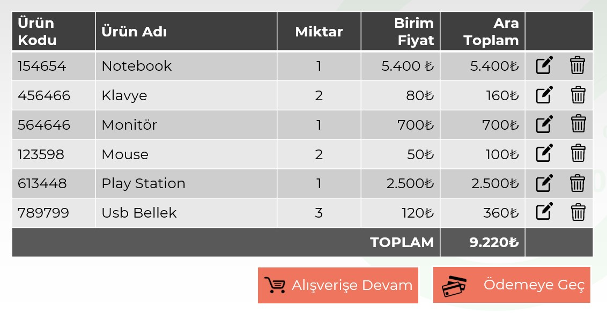

# Instructions  

Shopping cart uygulaması ile ilgili aşağıdaki görüntüyü elede edecek ve gereksinimleri karşılayacak bir çalışma yapınız

  ## Steps
  1. Table kullanarak yapılacaktır
  2. Thead, tbody ve tfoot yapısı kullanınız
  3. Fontawesome ikon kütüphanesi kullanınız
  4. tbody kısmındaki satır renkleri pseudo class ile yapılacaktır
  5. Buton simgeleri pseudo element ile yapılacaktır
  6. Butonlarda hover özelliği olacaktır.
  7. Tbody içindeki row larda hover özelliği olacaktır

  
  